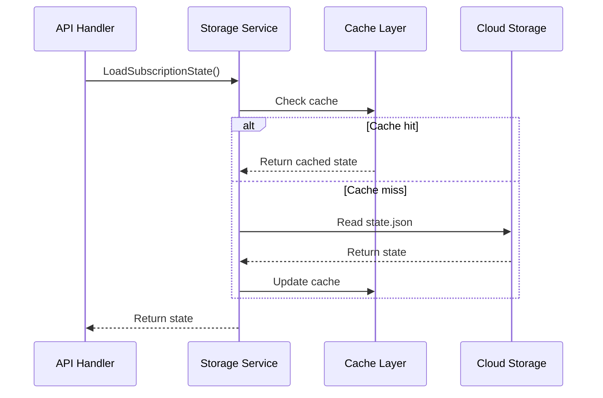

# Subscription Management Architecture

## Overview

The subscription management system handles YouTube channel subscriptions via the PubSubHubbub protocol, maintaining persistent state and ensuring subscriptions remain active through auto-renewal.

## Components

### Subscription Model

```go
type Subscription struct {
    ChannelID        string
    ChannelName      string
    TopicURL         string
    CallbackURL      string
    Status           string    // "active", "expired", "pending"
    LeaseSeconds     int
    SubscribedAt     time.Time
    ExpiresAt        time.Time
    LastRenewal      time.Time
    RenewalAttempts  int
    HubResponse      string
}
```

### State Management

```go
type SubscriptionState struct {
    Subscriptions map[string]*Subscription
    Metadata      *Metadata
}

type Metadata struct {
    LastUpdated time.Time
    Version     string
}
```

## Storage Architecture

### Cloud Storage Structure
```
gs://bucket/
└── subscriptions/
    ├── state.json           # Current state
    └── backups/
        └── state-{timestamp}.json  # Historical backups
```

### State Persistence Flow



## PubSubHubbub Integration

### Subscription Flow

1. **Subscribe Request**
   ```http
   POST /subscribe?channel_id=UCXuqSBlHAE6Xw-yeJA0Tunw
   ```

2. **Hub Interaction**
   ```http
   POST https://pubsubhubbub.appspot.com/subscribe
   Content-Type: application/x-www-form-urlencoded
   
   hub.callback=https://function-url/YouTubeWebhook
   hub.topic=https://www.youtube.com/feeds/videos.xml?channel_id=UCXuqSBlHAE6Xw-yeJA0Tunw
   hub.mode=subscribe
   hub.verify=async
   hub.lease_seconds=86400
   ```

3. **Verification Challenge**
   ```http
   GET /YouTubeWebhook?hub.challenge=abc123&hub.mode=subscribe
   Response: abc123
   ```

4. **State Update**
   - Store subscription in state
   - Set expiry time
   - Update metadata

### Unsubscribe Flow

1. **Unsubscribe Request**
   ```http
   DELETE /unsubscribe?channel_id=UCXuqSBlHAE6Xw-yeJA0Tunw
   ```

2. **Hub Notification**
   - Send unsubscribe request to hub
   - Wait for confirmation

3. **State Cleanup**
   - Remove from state only after hub confirms
   - Maintain consistency

## Auto-Renewal System

### Cloud Scheduler Configuration

```hcl
resource "google_cloud_scheduler_job" "subscription_renewal" {
  name        = "youtube-subscription-renewal-${var.environment}"
  schedule    = var.renewal_schedule  # "0 */6 * * *"
  time_zone   = "UTC"
  
  http_target {
    http_method = "POST"
    uri         = "${function_url}/renew"
    
    oidc_token {
      service_account_email = service_account.email
    }
  }
}
```

### Renewal Logic

```go
func handleRenewSubscriptions() {
    state := LoadSubscriptionState()
    threshold := time.Now().Add(12 * time.Hour)
    
    for _, sub := range state.Subscriptions {
        if sub.ExpiresAt.Before(threshold) {
            if sub.RenewalAttempts < maxAttempts {
                renewSubscription(sub)
            }
        }
    }
}
```

### Renewal Strategy

1. **Threshold Check**: Renew if expiring within 12 hours
2. **Retry Logic**: Max 3 attempts with exponential backoff
3. **Failure Handling**: Log failures for monitoring
4. **State Updates**: Track renewal attempts and timestamps

## Concurrency & Thread Safety

### Mutex Protection

```go
var testSubscriptionStateMutex sync.RWMutex

func loadTestModeState() *SubscriptionState {
    testSubscriptionStateMutex.Lock()
    defer testSubscriptionStateMutex.Unlock()
    return deepCopyState(testSubscriptionState)
}
```

### Deep Copy Implementation

```go
func deepCopyState(state *SubscriptionState) *SubscriptionState {
    data, _ := json.Marshal(state)
    var copy SubscriptionState
    json.Unmarshal(data, &copy)
    return &copy
}
```

## Error Handling

### Error Categories

1. **Validation Errors** (400)
   - Invalid channel ID format
   - Missing required parameters

2. **State Errors** (404/409)
   - Subscription not found
   - Already subscribed

3. **Hub Errors** (502/503/504)
   - Hub unreachable
   - Hub timeout
   - Hub internal error

4. **Storage Errors** (500)
   - Cloud Storage unavailable
   - State corruption

### Error Response Format

```json
{
  "status": "error",
  "channel_id": "UCXuqSBlHAE6Xw-yeJA0Tunw",
  "message": "Descriptive error message"
}
```

## Configuration

### Environment Variables

```bash
# Required
SUBSCRIPTION_BUCKET=your-bucket-name
FUNCTION_URL=https://region-project.cloudfunctions.net/YouTubeWebhook

# Optional
SUBSCRIPTION_LEASE_SECONDS=86400    # 24 hours
RENEWAL_THRESHOLD_HOURS=12          # Renew when < 12 hours left
MAX_RENEWAL_ATTEMPTS=3               # Max retry attempts
```

### Channel ID Validation

- Format: `^UC[a-zA-Z0-9_-]{22}$`
- Length: Exactly 24 characters
- Prefix: Must start with "UC"
- Characters: Alphanumeric, underscore, hyphen

## Testing Strategy

### Unit Tests
- State serialization/deserialization
- Channel ID validation
- Error handling paths
- Renewal logic

### Integration Tests
- End-to-end subscription flow
- Cloud Storage persistence
- Hub verification handling
- Auto-renewal triggers

### Load Tests
- Concurrent subscriptions
- State file locking
- Cache performance
- Renewal under load

## Performance Optimizations

### Caching
- 5-minute TTL for state cache
- Reduces Cloud Storage reads
- Thread-safe implementation

### Connection Pooling
- Singleton storage client
- Reuses HTTP connections
- Reduces latency

### Batch Operations
- Process multiple renewals together
- Minimize API calls
- Efficient state updates